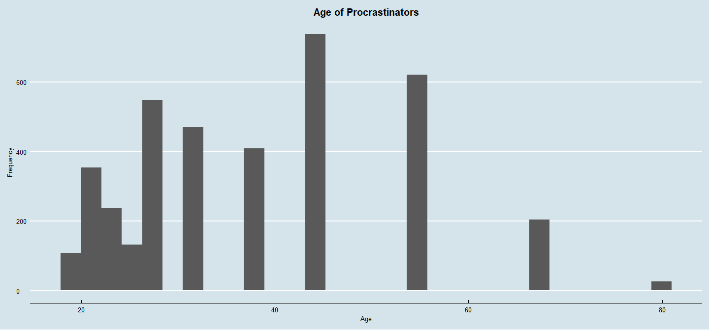
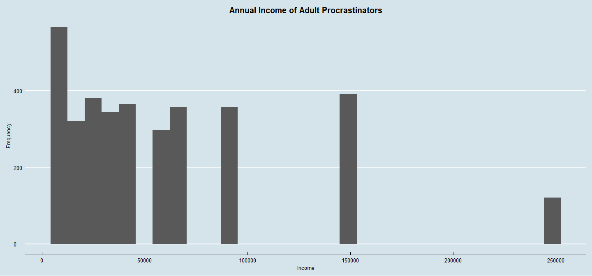
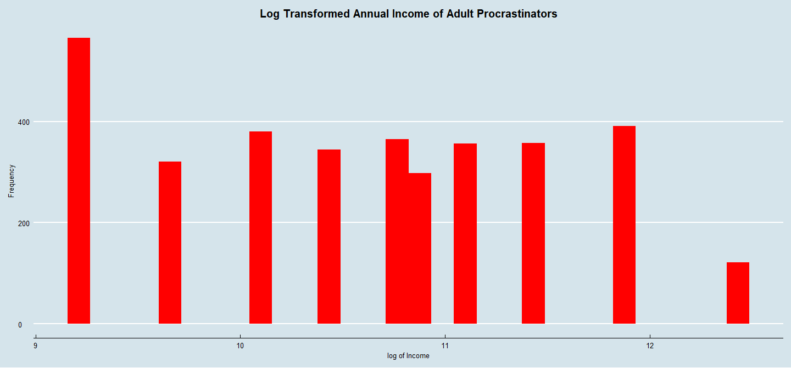
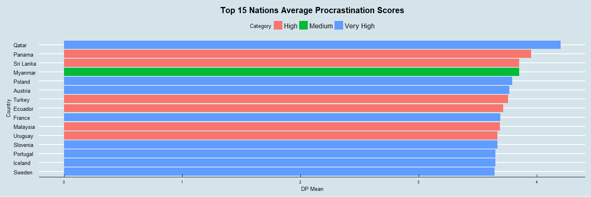
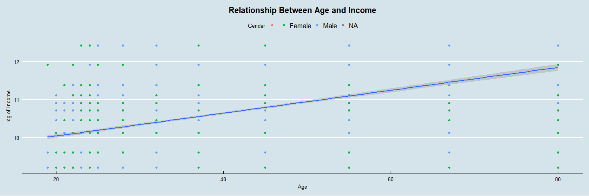
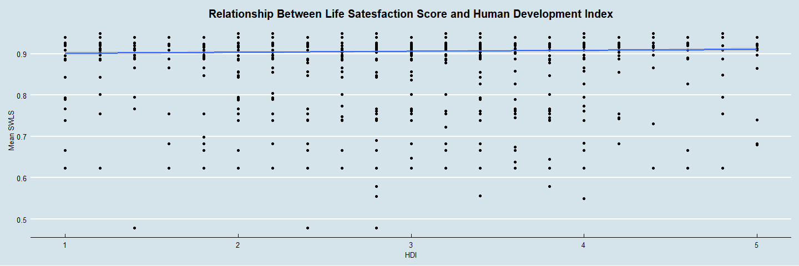
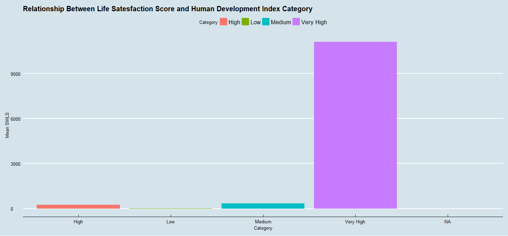

Case Study 2
================
Lizzy Sterling and Casey Martinez
12/06/2017

<<<<<<< HEAD
``` r
knitr::opts_knit$set(root.dir = '/Users/lizzysterling/Desktop/CaseStudy2/Analysis/Data')
```

We are taking a look at the raw data frame.

``` r
#1A
#Work on fixing the directory so that this does not need to be included
Procrastination <- read.csv("Procrastination.csv", header=TRUE)
dim(Procrastination)
```

    ## [1] 4264   61

In order to make the data set human-readable, we need to change the column names so that they make more sense.

``` r
#1B
#colnames(Procrastination)
names(Procrastination)[1:14] <- c("Age", "Gender", "Kids", "Education", "WorkStatus", "AnnualIncome", "Occupation", "OccupationYears", "OccupationMonths", "CommunitySize", "CountryOfResidence", "MaritalStatus", "NumberSons", "NumberDaughers")
#How do you want to label columns 15:61?
```

Now that we know all of the column names, we need to check and make sure all of the values in the columns are accurate.

First, we need to make the values of `OccupationYears` to integers so that we can determine which years do not makes sense.

``` r
#1C
Procrastination$OccupationYears <- round(Procrastination$OccupationYears)
data.frame(unique(Procrastination$OccupationYears))
```

    ##    unique.Procrastination.OccupationYears.
    ## 1                                        9
    ## 2                                        0
    ## 3                                       14
    ## 4                                        1
    ## 5                                        8
    ## 6                                       NA
    ## 7                                        2
    ## 8                                        6
    ## 9                                        5
    ## 10                                       3
    ## 11                                       7
    ## 12                                      10
    ## 13                                      30
    ## 14                                      17
    ## 15                                       4
    ## 16                                      12
    ## 17                                      23
    ## 18                                      13
    ## 19                                      28
    ## 20                                     999

Now that we know the unique values of `OccupationYears`, we know that the 999 value is most likely a mistake. We are going to count the number of observations have this error in order to determine what to do next.

``` r
count(Procrastination[grep("999", Procrastination$OccupationYears),])
```

    ## # A tibble: 1 x 1
    ##       n
    ##   <int>
    ## 1    42

There are 42 entries that include 999 as their number of years in current occupation, so we are not going to delete those values. Instead, we are going to change all of the 999 entries to NAs.

``` r
Procrastination[grep("999", Procrastination$OccupationYears), "OccupationYears"] <- ""
```

In the `NumberSons` column, we need to check and see which values seem off.

``` r
data.frame(unique(Procrastination$NumberSons))
```

    ##   unique.Procrastination.NumberSons.
    ## 1                                  0
    ## 2                               Male
    ## 3                             Female
    ## 4                                  4
    ## 5                                  3
    ## 6                                 10
    ## 7                                  8
    ## 8                                  5
    ## 9

``` r
class(Procrastination$NumberSons)
```

    ## [1] "factor"

We know that in this column, `Male`= 1 Son and `Female` = 2 Sons. Therefore, we need to change each Male and Female entry to their corresponding numbers.

``` r
#Figure out which regular expressions get the grep to only include what is in the quotations - right now both male and female are returning the same rows. Maybe because they are in factor format?
#Procrastination[grep("^Male", Procrastination$NumberSons),]
#Procrastination[grep("Female", Procrastination$NumberSons),]
```

In our `CountryOfResidence` column, we need to check and see which values seem off.

``` r
data.frame(unique(Procrastination$CountryOfResidence))
```

    ##    unique.Procrastination.CountryOfResidence.
    ## 1                                 El Salvador
    ## 2                                     Bolivia
    ## 3                                      Cyprus
    ## 4                              Czech Republic
    ## 5                                     Morocco
    ## 6                                     Ukraine
    ## 7                                       Qatar
    ## 8                                     Antigua
    ## 9                                     Vietnam
    ## 10                                  Lithuania
    ## 11                               Saudi Arabia
    ## 12                                   Bulgaria
    ## 13                                  Macedonia
    ## 14                                  Sri Lanka
    ## 15                                    Ecuador
    ## 16                                Afghanistan
    ## 17                                     Panama
    ## 18                                       Guam
    ## 19                                   Pakistan
    ## 20                                    Estonia
    ## 21                                      Kenya
    ## 22                                     Guyana
    ## 23                                Puerto Rico
    ## 24                                    Bermuda
    ## 25                                    Croatia
    ## 26                                     Taiwan
    ## 27                                    Hungary
    ## 28                                    Austria
    ## 29                                     Brunei
    ## 30                                 Kazakhstan
    ## 31                                      Malta
    ## 32                                 Luxembourg
    ## 33                                    Lebanon
    ## 34                                  Singapore
    ## 35                                  Venezuela
    ## 36                                    Uruguay
    ## 37                                  Argentina
    ## 38                                      Egypt
    ## 39                                  Nicaragua
    ## 40                                    Myanmar
    ## 41                                       Peru
    ## 42                                    Albania
    ## 43                         Dominican Republic
    ## 44                                    Andorra
    ## 45                                   Slovenia
    ## 46                                     Russia
    ## 47                                   Barbados
    ## 48                                Philippines
    ## 49                                   Malaysia
    ## 50                                     Greece
    ## 51                                    Denmark
    ## 52                                      Spain
    ## 53                                      Chile
    ## 54                                    Finland
    ## 55                                      Macao
    ## 56                                New Zealand
    ## 57                                 Yugoslavia
    ## 58                                    Romania
    ## 59                                    Iceland
    ## 60                                   Portugal
    ## 61                                   Thailand
    ## 62                                   Columbia
    ## 63                                      China
    ## 64                                      Ghana
    ## 65                                    Jamaica
    ## 66                                     Norway
    ## 67                                    Algeria
    ## 68                                Netherlands
    ## 69                                    Belgium
    ## 70                                      Japan
    ## 71                                     Isreal
    ## 72                                     Turkey
    ## 73                                     Sweden
    ## 74                                      Italy
    ## 75                                  Hong Kong
    ## 76                                    Ireland
    ## 77                                     France
    ## 78                                     Brazil
    ## 79                                       Iran
    ## 80                                     Mexico
    ## 81                                    Germany
    ## 82                             United Kingdom
    ## 83                                Switzerland
    ## 84                                    Bahamas
    ## 85                               South Africa
    ## 86                                     Poland
    ## 87                                  Australia
    ## 88                                South Korea
    ## 89                                   Botswana
    ## 90                                     Canada
    ## 91                                      India
    ## 92                              United States
    ## 93                                          0
    ## 94
=======
Project Overview
================

Now that we have completed data collection, which can be found in `Procrastination.csv`, it is now time to conduct analysis. As we discussed, there are a few variables in particular that are worth looking at. These include age, annual income, and country of origin.
\#\# Key Questions

### Libraries used

library(XML)
library(rvest)
library(dplyr)
library(ggplot2)
library(ggthemes)
library(plyr)
library(knitr)

``` r
#knitr::opts_knit$set(root.dir = '/Users/lizzysterling/Desktop/CaseStudy2/Analysis/Data')
knitr::opts_knit$set(root.dir = "~/SMU Data Science/MSDS_6306_Doing_Data_Science/CaseStudy2/Analysis/Data")
```

Data Cleaning
-------------

Although we finished data collection, there is still some tidying to do. As you can see, it is a rather large data set, so we need to go back through and make sure that all of the entries are ready for analysis.

``` r
#2A
#setwd("Data")
Procrastination <- read.csv("Procrastination.csv", header = TRUE, stringsAsFactors = FALSE)
dim <- data.frame(nrow(Procrastination),ncol(Procrastination))
colnames(dim) <- c("Number of Rows", "Number of Columns")
kable(dim)
```

|  Number of Rows|  Number of Columns|
|---------------:|------------------:|
|            4264|                 61|

In order to make the data set human-readable, we need to change the column names so that they make more sense. *You can reference the README.md file in the `Data` folder for further descriptions of these columns (columns 15 to 61 in particular)*

``` r
#2B
names(Procrastination) <- c("Age", "Gender", "Kids", "Education", "WorkStatus", "AnnualIncome", "Occupation", "OccupationYears", "OccupationMonths", "CommunitySize", "CountryOfResidence", "MaritalStatus", "NumberSons", "NumberDaughters", "DP1", "DP2", "DP3", "DP4", "DP5", "AIP1", "AIP2", "AIP3", "AIP4", "AIP5", "AIP6", "AIP7", "AIP8", "AIP9", "AIP10", "AIP11", "AIP12", "AIP13", "AIP14", "AIP15", "GP1", "GP2", "GP3", "GP4", "GP5", "GP6", "GP7", "GP8", "GP9", "GP10", "GP11", "GP12", "GP13", "GP14", "GP15", "GP16", "GP17", "GP18", "GP19", "GP20", "SWLS1", "SWLS2", "SWLS3", "SWLS4", "SWLS5", "P1", "P2")
```

Now that we have human-readable column names, let's take a look at the data:

``` r
head(Procrastination)
```

    ##    Age Gender     Kids Education WorkStatus AnnualIncome Occupation
    ## 1 67.5   Male Yes Kids        ma    retired        25000           
    ## 2 45.0   Male Yes Kids       deg  part-time        35000           
    ## 3 19.0 Female  No Kids       dip    student           NA           
    ## 4 37.5   Male Yes Kids        ma  full-time        45000           
    ## 5 28.0 Female  No Kids       deg  full-time        35000           
    ## 6 23.0 Female  No Kids       deg  full-time        15000           
    ##   OccupationYears OccupationMonths CommunitySize CountryOfResidence
    ## 1         9.0e+00                0    Large-City        El Salvador
    ## 2         1.5e-19                0       Village            Bolivia
    ## 3         0.0e+00                0    Large Town             Cyprus
    ## 4         1.4e+01                0    Large Town     Czech Republic
    ## 5         1.0e+00                0       Village     Czech Republic
    ## 6         1.0e+00                0    Small Town     Czech Republic
    ##   MaritalStatus NumberSons NumberDaughters DP1 DP2 DP3 DP4 DP5 AIP1 AIP2
    ## 1      Divorced          0               5   3   1   1   1   1    1    1
    ## 2       Married       Male               1   3   4   3   3   3    3    1
    ## 3        Single          0               0   5   5   2   3   3    5    4
    ## 4       Married          0               1   3   3   3   3   3    2    1
    ## 5        Single          0               0   3   3   2   1   1    1    1
    ## 6        Single          0               0   3   4   3   2   2    2    5
    ##   AIP3 AIP4 AIP5 AIP6 AIP7 AIP8 AIP9 AIP10 AIP11 AIP12 AIP13 AIP14 AIP15
    ## 1    1    1    1    1    1    1    5     1     1     1     1     1     3
    ## 2    4    3    3    4    3    3    3     3     4     2     2     2     4
    ## 3    4    5    5    5    5    4    5     5     4     3     5     4     3
    ## 4    4    3    5    3    4    5    4     5     4     3     4     2     1
    ## 5    3    3    2    2    2    2    1     1     2     1     2     1     2
    ## 6    5    5    5    3    5    4    4     5     3     5     4     5     5
    ##   GP1 GP2 GP3 GP4 GP5 GP6 GP7 GP8 GP9 GP10 GP11 GP12 GP13 GP14 GP15 GP16
    ## 1   1   1   1   1   1   1   1   1   1    1    5    1    1    1    1    1
    ## 2   4   2   2   2   2   2   4   2   4    2    3    4    2    2    3    4
    ## 3   5   2   2   4   3   1   3   2   5    4    5    5    3    4    5    2
    ## 4   4   1   3   3   2   3   4   5   4    1    3    4    3    3    4    4
    ## 5   4   1   2   4   5   2   4   2   4    1    2    3    2    4    3    2
    ## 6   5   5   2   5   4   4   5   4   4    3    4    4    3    4    4    4
    ##   GP17 GP18 GP19 GP20 SWLS1 SWLS2 SWLS3 SWLS4 SWLS5  P1  P2
    ## 1    1    5    1    5     5     5     5     5     5  no  no
    ## 2    3    3    4    4     3     4     4     4     3 yes yes
    ## 3    3    5    5    4     2     2     2     3     4 yes yes
    ## 4    3    4    5    1     2     4     2     2     2 yes yes
    ## 5    3    2    3    4     4     4     4     3     4  no  no
    ## 6    4    4    4    4     3     2     4     4     3 yes yes

We need to change the `Age` column so that they are in whole numbers.

``` r
Procrastination$Age <- as.integer(Procrastination$Age)
```

The other column needs to be converted to factor variables.

``` r
Procrastination$Gender <- as.factor(Procrastination$Gender)

Procrastination$WorkStatus <- as.factor(Procrastination$WorkStatus)
levels(Procrastination$WorkStatus)[levels(Procrastination$WorkStatus) == "0"] <- ""

Procrastination$P1 <- as.factor(Procrastination$P1)
Procrastination$P2 <- as.factor(Procrastination$P2)
levels(Procrastination$P2)[levels(Procrastination$P2) == "0"] <- ""
levels(Procrastination$P2)[levels(Procrastination$P2) == "4"] <- ""
```

We also need to make the values of `OccupationYears` to integers and then determine which years do not makes sense.

``` r
#Question #2C
Procrastination$OccupationYears <- as.integer(Procrastination$OccupationYears)
OccupationYears <- data.frame(unique(Procrastination$OccupationYears))
colnames(OccupationYears) <- "OccupationYears"
kable(OccupationYears)
```

|  OccupationYears|
|----------------:|
|                9|
|                0|
|               14|
|                1|
|                8|
|               NA|
|                2|
|                6|
|                5|
|                3|
|                7|
|               10|
|               30|
|               17|
|                4|
|               12|
|               23|
|               13|
|               28|
|              999|

We are going to change all of the 999 entries to NAs, because this is likely a mistake.

``` r
#Question 2ci
Procrastination[grep("999", Procrastination$OccupationYears), "OccupationYears"] <- ""
```

Now looking at the `NumberSons` column, we noticed that some of the entries are `Male` and `Female` rather than integer values.

``` r
NumberSons <- data.frame(unique(Procrastination$NumberSons))
colnames(NumberSons) <- "Number of Sons"
kable(NumberSons)
```

| Number of Sons |
|:---------------|
| 0              |
| Male           |
| Female         |
| 4              |
| 3              |
| 10             |
| 8              |
| 5              |
|                |

We know that in this column, `Male`= 1 Son and `Female` = 2 Sons. Therefore, we need to change each Male and Female entry to their corresponding numbers so that they can be counted correctly.

``` r
Procrastination[grep("^Male.*", Procrastination$NumberSons),"NumberSons"] <- rep(1, length(Procrastination[grep("^Male.*", Procrastination$NumberSons),"NumberSons"]))

Procrastination[grep("^Female.*", Procrastination$NumberSons),"NumberSons"] <- rep(2, length(Procrastination[grep("^Female.*", Procrastination$NumberSons),"NumberSons"]))
```

In our `CountryOfResidence` column, we only want values that are really countries.

``` r
Country <- data.frame(unique(Procrastination$CountryOfResidence))
colnames(Country) <- "Countries"
kable(head(sort(Country$Countries), n=10))
```

    ## Warning in kable_markdown(x = structure(c("", "0", "Afghanistan",
    ## "Albania", : The table should have a header (column names)

|             |
|:------------|
|             |
| 0           |
| Afghanistan |
| Albania     |
| Algeria     |
| Andorra     |
| Antigua     |
| Argentina   |
| Australia   |
| Austria     |
>>>>>>> a3f60471332932ab6b8606e9af8d592139f4bd98

Because 0 is not a country of residence, we need to change it to a NA.

``` r
Procrastination[grep("0", Procrastination$CountryOfResidence), "CountryOfResidence"] <- ""
```

<<<<<<< HEAD
Looking at `Occupation`, we need to check and see which values are not Occupations.

``` r
data.frame(unique(Procrastination$Occupation))
```

    ##            unique.Procrastination.Occupation.
    ## 1                                            
    ## 2                                           0
    ## 3                           financial analyst
    ## 4                            language trainer
    ## 5                                      Editor
    ## 6                                         ouh
    ## 7                                     retired
    ## 8                              Software Sales
    ## 9                               Civil servant
    ## 10                             please specify
    ## 11                                    Economy
    ## 12                              sales manager
    ## 13                                    manager
    ## 14                          BUSINESS CONSULTA
    ## 15                                Copy Writer
    ## 16            Gender/Public Health Consultant
    ## 17                      chairman of the board
    ## 18                           Media Consultant
    ## 19                      Social Policy Analyst
    ## 20                                    Finance
    ## 21                                 Translator
    ## 22                         Technical director
    ## 23                             audio engineer
    ## 24                         Research Associate
    ## 25                                 Controller
    ## 26                              businesswoman
    ## 27                          Financial Advisor
    ## 28                                         IT
    ## 29                                 Programmer
    ## 30                     airport ground handler
    ## 31                        Computer Programmer
    ## 32                                    teacher
    ## 33                           Computer Science
    ## 34                                 Unemployed
    ## 35       EFL Teacher/ Professional Researcher
    ## 36                          Doctor; Physician
    ## 37                         Software Developer
    ## 38                                   Attorney
    ## 39                                  secretary
    ## 40                     journalist (freelance)
    ## 41                               nursing home
    ## 42                                  Developer
    ## 43             Director of a language program
    ## 44                           Graphic Designer
    ## 45                             system manager
    ## 46                               ICT Director
    ## 47                Chiefe Development Engineer
    ## 48                                 consultant
    ## 49        Assoc. Governmental Program Analyst
    ## 50                                   houswife
    ## 51                              Administrator
    ## 52                   IT systems administrator
    ## 53                        Computer Consultant
    ## 54  student fysiotherapy /home care / massage
    ## 55                              Astrohysicist
    ## 56            Student and part time secretary
    ## 57                                 Journalist
    ## 58                                   lecturer
    ## 59        Teaching Assistant/Graduate student
    ## 60                             Business Owner
    ## 61                               entrepreneur
    ## 62                         free professionist
    ## 63                                 Agronomist
    ## 64                          college professor
    ## 65                                    dentist
    ## 66                                   director
    ## 67                       Financial Controller
    ## 68                                   attorney
    ## 69     President Nongovernmental organization
    ## 70                              Dance teacher
    ## 71                     coordinatore operativo
    ## 72                                interpreter
    ## 73                   self-employed translator
    ## 74                         Research Scientist
    ## 75                       Disability Allowance
    ## 76                               Sales Expert
    ## 77                                    Postdoc
    ## 78                                  Physicist
    ## 79                                      Sales
    ## 80                                   engineer
    ## 81                                   Musician
    ## 82                             System Analyst
    ## 83                                    trainee
    ## 84                               Web Designer
    ## 85                                Dish Washer
    ## 86                      ESL Teacher/Biologist
    ## 87                            Sales executive
    ## 88                      Freelance ESL Teacher
    ## 89                      Information Developer
    ## 90                                   IT admin
    ## 91                           Network Engineer
    ## 92        student childhood and youth studies
    ## 93                            Quality Manager
    ## 94                               Town Planner
    ## 95                        assistant professor
    ## 96                                   business
    ## 97                              civil servant
    ## 98                      Technical support rep
    ## 99                Programmer/Software Analyst
    ## 100                           Project Manager
    ## 101                          company director
    ## 102                          Customer Service
    ## 103            cataloguer /  freelance artist
    ## 104                   deputy practice manager
    ## 105                                 Architect
    ## 106                                   Analyst
    ## 107                                IT Support
    ## 108                              Receptionist
    ## 109            treatment support co-ordinator
    ## 110                                  producer
    ## 111                                  Academic
    ## 112                   Postdoctoral Researcher
    ## 113                           student/barmaid
    ## 114                                   airline
    ## 115                       Creative Consultant
    ## 116                   Business / Test Analyst
    ## 117                    IT security consultant
    ## 118                         Executive officer
    ## 119                             IT consultant
    ## 120                       IT Support Engineer
    ## 121                           Doctor Research
    ## 122                    information assisstant
    ## 123                       Television Producer
    ## 124                             Press Officer
    ## 125                                    writer
    ## 126                            Procrastinator
    ## 127                Professional Soccer Player
    ## 128                                     fdsdf
    ## 129                                Accountant
    ## 130               Pharmaceutical Merchandiser
    ## 131               Education (at a university)
    ## 132                             IT Consultant
    ## 133                          energy therapist
    ## 134                               psychologis
    ## 135                             HR generalist
    ## 136                            Physiotherapst
    ## 137                          Technical Writer
    ## 138                            Market Analyst
    ## 139               Office Manager / Accountant
    ## 140                  Administration Assistant
    ## 141                                IT Manager
    ## 142               Internet & media consultant
    ## 143         Information Technology Consultant
    ## 144                              Housekeeping
    ## 145                        Web Communications
    ## 146                      Medical Practitioner
    ## 147                              veterinarian
    ## 148      Management Consultant & Entrepreneur
    ## 149                         Technical officer
    ## 150                      Service co-ordinator
    ## 151   Clutter clearer,  video editor, caterer
    ## 152                               entertainer
    ## 153                                 Scientist
    ## 154                                     clerk
    ## 155                             Self Employed
    ## 156                                 President
    ## 157                                 pathology
    ## 158   Divisional Manager of a large cosmetics
    ## 159                                 Marketing
    ## 160                                    Driver
    ## 161                       Director Operations
    ## 162                                     Nurse
    ## 163                                 Sales Rep
    ## 164                        Fitness Instructor
    ## 165                             Residence Don
    ## 166                    Regional Sales Manager
    ## 167                    Country Style Employee
    ## 168                           Systems Analyst
    ## 169                               Facilitator
    ## 170                self-employed Photographer
    ## 171                        Research Assistant
    ## 172                                  Military
    ## 173                            policy analyst
    ## 174                                 Geologist
    ## 175            Instructional Assistant Online
    ## 176                                    Server
    ## 177                                 innkeeper
    ## 178                 Freelance Project Manager
    ## 179         Deputy Chieif Information Officer
    ## 180                     selfemplyed renovator
    ## 181                                Accounting
    ## 182                Systems Programmer/Analyst
    ## 183  Manager - Analytical and Environmental S
    ## 184                             Grease Monkey
    ## 185              Director of Software Company
    ## 186                 Speaker Author Consultant
    ## 187                                   Janitor
    ## 188                            vice-president
    ## 189         Senior Human Resources Consultant
    ## 190               Communications & Publishing
    ## 191                  Artist/ designer/builder
    ## 192                Director,social Dvelopment
    ## 193                    Senior Systems Analyst
    ## 194                         Software engineer
    ## 195                      Training Coordinator
    ## 196                              Statistician
    ## 197               Student / working part-time
    ## 198  Computer Instructor (Continuing Educatio
    ## 199                                 Counselor
    ## 200                                        na
    ## 201       Program Manager and Acting Director
    ## 202                                 Biologist
    ## 203        pro poker player /   website owner
    ## 204  VP Scientific Affairs / pharmaceutical c
    ## 205                           Deputy Director
    ## 206                        operations manager
    ## 207                                C E O/ M D
    ## 208                    Head - Operations & QA
    ## 209                              Software Pro
    ## 210                            tax consultant
    ## 211                          Research Scholar
    ## 212                                   student
    ## 213          Collection management specialist
    ## 214                           project manager
    ## 215                                  Lift Ops
    ## 216            Self-employed Family Therapist
    ## 217                 special education teacher
    ## 218                        Camera Coordinator
    ## 219                                  Designer
    ## 220                         Produce Associate
    ## 221  supervisor shelderd workshop for handcap
    ## 222                                 Braillist
    ## 223                         election services
    ## 224                               Corrections
    ## 225                      Probation Supervisor
    ## 226                               Bank Teller
    ## 227                         Computer Operator
    ## 228                              Case Manager
    ## 229                                       LPN
    ## 230                         Massage Therapist
    ## 231                            vice president
    ## 232                    Traffic Reporter-Radio
    ## 233           Residential Services Supervisor
    ## 234                 Language Service Provider
    ## 235                                 Executive
    ## 236                    Lab Services Assistant
    ## 237                                       ceo
    ## 238                Film Industry/Miscelanious
    ## 239                             acupuncturist
    ## 240   Technology Curriculum Developer Science
    ## 241                                home maker
    ## 242                                 Freelance
    ## 243                           Insurance Agent
    ## 244                               real estate
    ## 245                                        RN
    ## 246                                 associate
    ## 247             Restaurant operations manager
    ## 248                Labor Relations Specialist
    ## 249                TV News Executive Producer
    ## 250                                 Librarian
    ## 251      First VP & Associate General Counsel
    ## 252     Coordinator of International Programs
    ## 253                            Chief of Staff
    ## 254                              yoga teacher
    ## 255                        Volunteer Director
    ## 256               Pastor ; Life coach  clergy
    ## 257                          Research Analyst
    ## 258                     electronic technician
    ## 259                        Associate Producer
    ## 260                                       VMD
    ## 261                                       abc
    ## 262           media relations/science writing
    ## 263                                     buyer
    ## 264                                     Owner
    ## 265                          University Staff
    ## 266                        landscape designer
    ## 267                 Network Services Engineer
    ## 268                   Special Projects Editor
    ## 269                     free lance bookkeeper
    ## 270  Urban Planner/Economic Development Plann
    ## 271                        Executive Director
    ## 272                      marketing copywriter
    ## 273                                 Economist
    ## 274                                    Studey
    ## 275                                bookseller
    ## 276                                 Assistant
    ## 277                    Professional Organizer
    ## 278            Outdoor Recreation Coordinator
    ## 279                      Attorney – Associate
    ## 280                             Co-Proprietor
    ## 281                            Antique Dealer
    ## 282                   Market Research Analyst
    ## 283                           law enforcement
    ## 284                           insurance agent
    ## 285                Parent Educator/Supervisor
    ## 286          Legal Assistant / Office Manager
    ## 287                             museum docent
    ## 288                                Publishing
    ## 289                         maintenance tech.
    ## 290                           Research intern
    ## 291                      employed by a church
    ## 292                        RN - Medical Sales
    ## 293             Client Relationship Assistant
    ## 294                            Communications
    ## 295                           copy supervisor
    ## 296                   Data Warehouse Engineer
    ## 297           Dental & Disability Coordinator
    ## 298                             writer/editor
    ## 299                         Nanny and student
    ## 300                       Program Coordinator
    ## 301                             Social Worker
    ## 302                      training Coordinator
    ## 303                                       EOD
    ## 304                                bookkeeper
    ## 305                                     Tutor
    ## 306                                      host
    ## 307                    Human Resource Manager
    ## 308  owner - private practice physical therap
    ## 309                                  advocate
    ## 310                       Aviation Specialist
    ## 311                                      CRNA
    ## 312                  education administration
    ## 313        Customer Service at Domino's Pizza
    ## 314                          Writer / eductor
    ## 315                      Accounting Assistant
    ## 316                          Program Director
    ## 317                          Tech Analyst/GIS
    ## 318                            jewelry artist
    ## 319                         real estate agent
    ## 320                               IT director
    ## 321                        Investment Counsel
    ## 322                   Food Service Supervisor
    ## 323           Environmental Senior Specialist
    ## 324                      research coordinator
    ## 325                                  Diplomat
    ## 326                          Stay-at-home dad
    ## 327                   Theater General Manager
    ## 328    Graduate student/University instructor
    ## 329                         Field Coordinator
    ## 330                     laboratory technician
    ## 331                 Box Office Representative
    ## 332                     Facilities Management
    ## 333  Freelance musician / part time EMT / pri
    ## 334                                 Dietitian
    ## 335                                   realtor
    ## 336                    Information Management
    ## 337                   Office Services Manager
    ## 338              Juvenile Corrections Officer
    ## 339                                   stocker
    ## 340                       Account Service Rep
    ## 341                                    intern
    ## 342                              set designer
    ## 343                             Groundskeeper
    ## 344                  library paraprofessional
    ## 345                        Ecology technician
    ## 346                                    Artist
    ## 347  Consultant and entrepreneur (small busin
    ## 348                  Food Department Director
    ## 349               Graduate Research Assistant
    ## 350                           psychotherapist
    ## 351                    In-house Legal Counsel
    ## 352          Writer and management consultant
    ## 353      Senior Consultant Programmer/Analyst
    ## 354                                       EMT
    ## 355                       Legislation Analyst
    ## 356                          public relations
    ## 357                           sales insurance
    ## 358                    Writer/editor/musician
    ## 359                                  designer
    ## 360                           Legal Assistant
    ## 361                         Proposal Director
    ## 362                        real estate broker
    ## 363           Vice President / program office
    ## 364                        regulatory affairs
    ## 365                        Associate Director
    ## 366                              wig designer
    ## 367                            Campus Planner
    ## 368                    Administrative Officer
    ## 369                    phd student researcher
    ## 370                         Teacher assistant
    ## 371                    Senior Records Analyst
    ## 372                  musician/student/teacher
    ## 373    Teacher and Full Time Doctoral Student
    ## 374                               health care
    ## 375                      Multimedia Developer
    ## 376                       Executive Assistant
    ## 377                     Insurance Coordinator
    ## 378                             Speaker/Actor
    ## 379                   Retail / artist /writer
    ## 380                      Artist/administrator
    ## 381                   Social Media consultant
    ## 382                                Pharmacist
    ## 383                        Program Specialist
    ## 384                    Science writing intern
    ## 385                                    school
    ## 386                       research specialist
    ## 387                                manager IT
    ## 388                                     Nanny
    ## 389                            Epidemiologist
    ## 390                                 HVAC Tech
    ## 391                        Accounting Manager
    ## 392               Self-employed writer/editor
    ## 393                     Healthcare Consultant
    ## 394                                researcher
    ## 395                              chiropractor
    ## 396                           college faculty
    ## 397                    Information technology
    ## 398   P-T College Faculty & P-T Self-Employed
    ## 399                     Respiratory Therapist
    ## 400                                 Insurance
    ## 401                            Office Manager
    ## 402                              admin assist
    ## 403                      Warehouse Supervisor
    ## 404       Director of non-profit organization
    ## 405                 Sr. Drug Safety Associate
    ## 406                     Electrical Technician
    ## 407                       Senior Staff Writer
    ## 408                        Writing Consultant
    ## 409                federal excise tax auditor
    ## 410                           retired/adjunct
    ## 411                       television director
    ## 412                                quad racer
    ## 413                        university faculty
    ## 414                              IT Assistant
    ## 415                            anthropologist
    ## 416                     Environmental Analyst
    ## 417                       Post Grad Physician
    ## 418                           writer/musician
    ## 419                Staff Writer at a magazine
    ## 420                    Research / GIS analyst
    ## 421  environmental education non profit direc
    ## 422                          technical writer
    ## 423                                IT analyst
    ## 424       Full-Time Mother / Part-Time Editor
    ## 425                          Casting Director
    ## 426                      Financial Consultant
    ## 427                     Real estate developer
    ## 428                              Tech Support
    ## 429          pr and communications firm owner
    ## 430                        Library technician
    ## 431                         Surgical Resident
    ## 432                      Grants Administrator
    ## 433                      Senior Grant Officer
    ## 434     Student part-time and sales full-time
    ## 435          Psychiatrist in Private Practice
    ## 436                              Office Admin
    ## 437                          School Counselor
    ## 438                               new realtor
    ## 439          Medical / Public Health Educator
    ## 440     self-employed freelance writer/author
    ## 441                             self employed
    ## 442                          student/imvestor
    ## 443                        Social Work Intern
    ## 444  Administrative Asistant for Jewelry Stor
    ## 445                                 Computers
    ## 446                    Bar & Restaurant Owner
    ## 447                                         s
    ## 448           Licensed Professional Counselor
    ## 449  supervising program development speciali
    ## 450                                   Surgeon
    ## 451                      Programmer/Developer
    ## 452                   Master Control Operator
    ## 453          Test Item Writer (Self-employed)
    ## 454                                 Secretary
    ## 455                          Hotel Desk Clerk
    ## 456                                   Actress
    ## 457                          Accounts Payable
    ## 458                  medical transcriptionist
    ## 459  Self-Employed / personal trainer / stren
    ## 460         Director / information technology
    ## 461                                    Retail
    ## 462                          rocket scientist
    ## 463                             manufacturing
    ## 464                                 Paralegal
    ## 465                      Capstone Golf Course
    ## 466                    laborer (construction)
    ## 467                          temporary office
    ## 468               Student and Private Curator
    ## 469                        Graduate Assistant
    ## 470                        Programmer Analyst
    ## 471                                Town Clerk
    ## 472                        Consulting Manager
    ## 473                  Investigative Specialist
    ## 474            writer / lecturer / consultant
    ## 475                                        md
    ## 476                               Asst. Prof.
    ## 477                               EHS Manager
    ## 478                           Program Manager
    ## 479  Ornithology Graduate Student and Teachin
    ## 480               Research/Teaching Assistant
    ## 481                                    Dealer
    ## 482              Mentor/Special Events intern
    ## 483                             IT Technician
    ## 484                     Real Estate Appraiser
    ## 485  Attorney - self employed for 2 years – f
    ## 486                                Tour Guide
    ## 487   Graduate student--research and teaching
    ## 488                         Technical Trainer
    ## 489         catholic priest/ full timestudent
    ## 490                              Geophysicist
    ## 491                    ISTraining Coordinator
    ## 492                   set lighting technician
    ## 493                    senior project manager
    ## 494                                 enologist
    ## 495          Registered Respiratory Therapist
    ## 496                    Framer/Sales Associate
    ## 497  Fitness Assistant / wellness mentor / ca
    ## 498                             visual artist
    ## 499                         newspaper carrier
    ## 500                 Consumer Case Coordinator
    ## 501                       business consultant
    ## 502                                   Medical
    ## 503                 Manager,Interacitve Media
    ## 504                              Art Director
    ## 505                              Telemarketer
    ## 506                                   Partner
    ## 507            Associate / investment banking
    ## 508                                    trader
    ## 509                     Technical Coordinator
    ## 510  financial officer / small career-trainin
    ## 511                 artist/designer/homemaker
    ## 512  Special Education Administrative Assista
    ## 513                 assistant general counsel
    ## 514                  Private Equity Principal
    ## 515                         Creative Director
    ## 516                                 Law clerk
    ## 517                             president/CEO
    ## 518                               IT Director
    ## 519  Program director at a non-profit organiz
    ## 520                              Tax Examiner
    ## 521                               IT Engineer
    ## 522                         senior consultant
    ## 523               Physical Science Technician
    ## 524                            letter carrier
    ## 525    teacher's assistant/afterschool leader
    ## 526                               film editor
    ## 527              insurance broker's assistant
    ## 528                          Software trainer
    ## 529                            self employeed
    ## 530         Shipping/receiving/warehouse mgnt
    ## 531                     Senior Policy Advisor
    ## 532                       medical sonographer
    ## 533               Certified Nurse's Assistant
    ## 534                  Asst. Pre-school Teacher
    ## 535           Director of Contract Management
    ## 536                                   analyst
    ## 537                    financial risk manager
    ## 538                                    office
    ## 539            Self employed Public Relations
    ## 540                    Attorney-self employed
    ## 541                          Technology (CTO)
    ## 542                     associate at law firm
    ## 543  Please specify title Manager for Regulat
    ## 544                           Account Manager
    ## 545               Dept. Director (Non-profit)
    ## 546                       Mechanical Engineer
    ## 547                                Film maker
    ## 548                                Supervisor
    ## 549                Foreign Affairs Specialist
    ## 550                         bookkeeper/ actor
    ## 551                      Investment Assistant
    ## 552  restaurant mgr / student / and looking f
    ## 553                                Life Guard
    ## 554                            detail checker
    ## 555                           Student/Teacher
    ## 556                       Graduate Researcher
    ## 557   PCA for a quadrapilegic and a PCA for a
    ## 558                                       PCA
    ## 559                     College Administrator
    ## 560                             IT Specialist
    ## 561                        Academic Assistant
    ## 562  'Utterly shiftless arts student'... at p
    ## 563                     Human Resource Manger
    ## 564            volunteer mental health worker
    ## 565                   Media Relations Manager
    ## 566                          Research manager
    ## 567                        Medical Laboratory
    ## 568                         Financial Analyst
    ## 569                            Budget analyst
    ## 570                        resident physician
    ## 571                         Program Assistant
    ## 572                           Program officer
    ## 573  Deputy Chief of Public Information for t
    ## 574                             Public Health
    ## 575             Page Designer for a newspaper
    ## 576                            flight surgeon
    ## 577          Accounts Payable / Fleet Manager
    ## 578                   Theater artist/ Teacher
    ## 579                        Clinical Dietitian
    ## 580                 Entrepreneur & Consultant
    ## 581                          Process Engineer
    ## 582               Clinical Research Assistant
    ## 583                     Non-profit Consultant
    ## 584                            student/waiter
    ## 585  Early Childhood Education Student/ Nanny
    ## 586    Writer & Director of Content Solutions
    ## 587                        Recreational Staff
    ## 588  Organic Grocery Store Cashier/shift lead
    ## 589                                    banker
    ## 590                               Senate Page
    ## 591                        Online Media Buyer
    ## 592    Free lance editor and tutor--in theory
    ## 593                        instructor / coach
    ## 594                          land use planner
    ## 595                  Contsuruction Management
    ## 596                                 Bartender
    ## 597  full time student and part time bartende
    ## 598                     Sales/ daycare worker
    ## 599                                 education
    ## 600                            CAD Technician
    ## 601                                Internship
    ## 602                          Paraprofessional
    ## 603                    Vetrans Representative
    ## 604                    Researcher - Physician
    ## 605                    Environmental Engineer
    ## 606         Writer / web designer/ web-master
    ## 607                                   hostess
    ## 608                          business manager
    ## 609                                     Mover
    ## 610                         Library Assistant
    ## 611                Product Field Test Manager
    ## 612                   TV BROADCAST TECHNICIAN
    ## 613                 fulltime office assistant
    ## 614   Night Dispatch Supervisor  (it's just a
    ## 615                      Corporate instructor
    ## 616                           Editor Attorney
    ## 617                                      asst
    ## 618                       Reasearch assistant
    ## 619                         investment banker
    ## 620                     physician (internist)
    ## 621               Assistant District Attorney
    ## 622                     clinical psychologist
    ## 623      Service Registrar/English Instructor
    ## 624                     Management consultant
    ## 625                Webmaster / Print Designer
    ## 626                           account planner
    ## 627                         acounting analyst
    ## 628                           Legal Secretary
    ## 629                pjublic relations director
    ## 630                       research technician
    ## 631  Associate director/ marketing communicat
    ## 632          Director of business development
    ## 633                                      mktg
    ## 634            furniture maker, home restorer
    ## 635                   Chief Financial Officer
    ## 636                         Activities Leader
    ## 637                     Quotations specialist
    ## 638                  Early child hood teacher
    ## 639                            pharmacy tech.
    ## 640             Speech and language Assistant
    ## 641                       Assistant Professor
    ## 642   adjunct faculty / University + communit
    ## 643                            student/retail
    ## 644                Career Placement Associate
    ## 645                           steamship agent
    ## 646                      Education Specialist
    ## 647                  Clinical Trial Assistant
    ## 648                  Computer Systems Analyst
    ## 649                          IT Administrator
    ## 650  Executive Vice President / Senior Lender
    ## 651              Director of Academic Affairs
    ## 652                 Lab Director/Archeologist
    ## 653                                      Temp
    ## 654     Production Operations Support Analyst
    ## 655                          Educator/Student
    ## 656      Student and Administrative Assistant
    ## 657                              CAD operator
    ## 658              Plant Engineering Supervisor
    ## 659               Insurance Claims Supervisor
    ## 660                                 chauffeur
    ## 661                     Corporation President
    ## 662   academic/career coach & admin assistant
    ## 663                                specialist
    ## 664                               Proofreader
    ## 665                  Business Systems Analyst
    ## 666                         Corporate Trainer
    ## 667                              Farm Manager
    ## 668                                adult care
    ## 669                          Software analyst
    ## 670                   teacher / Administrator
    ## 671                              Gove service
    ## 672                                 warehouse
    ## 673                                     vidoe
    ## 674                    Grocery Store Salesman
    ## 675  Doctoral Candidate!!!  no wonder i'm doi
    ## 676                            photo profucer

First, we notice that `please specify` and `0` are not occupations, we can get rid of them.
=======
Looking at `Occupation`, we want to get rid of values that arent really jobs, as well as combine like-jobs together.

``` r
Occupation <- data.frame(unique(Procrastination$Occupation))
colnames(Occupation) <- "Occupation"
kable(head(sort(Occupation$Occupation), n=10))
```

    ## Warning in kable_markdown(x = structure(c("", "'Utterly shiftless arts
    ## student'... at p", : The table should have a header (column names)

|                                          |
|:-----------------------------------------|
|                                          |
| 'Utterly shiftless arts student'... at p |
| Accountant                               |
| acupuncturist                            |
| admin assist                             |
| anthropologist                           |
| Assistant                                |
| Attorney-self employed                   |
| bookseller                               |
| Communications                           |

Because this was a fill in the blank type question, there are many answers that could be grouped with others. We can group these occupations together so that we can get accurate counts. Some examples include entries that include `Teachers` and entries that include `Computer`.
>>>>>>> a3f60471332932ab6b8606e9af8d592139f4bd98

``` r
Procrastination[grep("0", Procrastination$Occupation), "Occupation"] <- ""
Procrastination[grep("please specify", Procrastination$Occupation), "Occupation"] <- ""
<<<<<<< HEAD
```

Next, we need to group certain occupations together so that we can get accurate counts.

``` r
#Error: invalid factor level, NA generated
Procrastination[(grep("teacher", Procrastination$Occupation)), "Occupation"] <- "Teacher"
```

    ## Warning in `[<-.factor`(`*tmp*`, iseq, value = c("Teacher", "Teacher",
    ## "Teacher", : invalid factor level, NA generated

``` r
Procrastination[(grep("Computer", Procrastination$Occupation)), "Occupation"] <- "Computers"
```

Looking at the `Kids` column, we only want to have a Yes or No response.

``` r
data.frame(unique(Procrastination$Kids))
```

    ##   unique.Procrastination.Kids.
    ## 1                     Yes Kids
    ## 2                      No Kids
    ## 3

``` r
#Look into regular expressions to get rid of this
```

Now that all of the columns are clean, we need to make sure they are of the correct data types.

``` r
sapply(Procrastination, class)
```

    ##                                                                                                                      Age 
    ##                                                                                                                "numeric" 
    ##                                                                                                                   Gender 
    ##                                                                                                                 "factor" 
    ##                                                                                                                     Kids 
    ##                                                                                                                 "factor" 
    ##                                                                                                                Education 
    ##                                                                                                                 "factor" 
    ##                                                                                                               WorkStatus 
    ##                                                                                                                 "factor" 
    ##                                                                                                             AnnualIncome 
    ##                                                                                                                "integer" 
    ##                                                                                                               Occupation 
    ##                                                                                                                 "factor" 
    ##                                                                                                          OccupationYears 
    ##                                                                                                              "character" 
    ##                                                                                                         OccupationMonths 
    ##                                                                                                                "integer" 
    ##                                                                                                            CommunitySize 
    ##                                                                                                                 "factor" 
    ##                                                                                                       CountryOfResidence 
    ##                                                                                                                 "factor" 
    ##                                                                                                            MaritalStatus 
    ##                                                                                                                 "factor" 
    ##                                                                                                               NumberSons 
    ##                                                                                                                 "factor" 
    ##                                                                                                           NumberDaughers 
    ##                                                                                                                "integer" 
    ##                                   X.DP.1..I.waste.a.lot.of.time.on.trivial.matters.before.getting.to.the.final.decisions 
    ##                                                                                                                "integer" 
    ##                                                              X.DP.2..Even.after.I.make.a.decision.I.delay.acting.upon.it 
    ##                                                                                                                "integer" 
    ##                                                                   X.DP.3..I.don.t.make.decisions.unless.I.really.have.to 
    ##                                                                                                                "integer" 
    ##                                                                     X.DP.4..I.delay.making.decisions.until.it.s.too.late 
    ##                                                                                                                "integer" 
    ##                                                                   X.DP.5..I.put.off.making.decisions.until.it.s.too.late 
    ##                                                                                                                "integer" 
    ##                                                                                          X.AIP.1..I.pay.my.bills.on.time 
    ##                                                                                                                "integer" 
    ##                                                                   X.AIP.2.I.am.prompt.and.on.time.for.most.appointments. 
    ##                                                                                                                "integer" 
    ##                        X.AIP.3.I.lay.out.my.clothes.the.night.before.I.have.an.important.appointment..so.I.won.t.be.late 
    ##                                                                                                                "integer" 
    ##                                                             X.AIP.4..I.find.myself.running.later.than.I.would.like.to.be 
    ##                                                                                                                "integer" 
    ##                                                                                 X.AIP.5..I.don.t.get.things.done.on.time 
    ##                                                                                                                "integer" 
    ##                             X.AIP.6..If.someone.were.teaching.a.course.on.how.to.get.things.done.on.time..I.would.attend 
    ##                                                                                                                "integer" 
    ##                                                       X.AIP.7..My.friends.and.family.think.I.wait.until.the.last.minute. 
    ##                                                                                                                "integer" 
    ##                                                                  X.AIP.8..I.get.important.things.done.with.time.to.spare 
    ##                                                                                                                "integer" 
    ##                                                                         X.AIP.9..I.am.not.very.good.at.meeting.deadlines 
    ##                                                                                                                "integer" 
    ##                                                                             X.AIP.10..I.find.myself.running.out.of.time. 
    ##                                                                                                                "integer" 
    ##                                           X.AIP.11..I.schedule.doctor.s.appointments.when.I.am.supposed.to.without.delay 
    ##                                                                                                                "integer" 
    ##                                                                     X.AIP.12..I.am.more.punctual.than.most.people.I.know 
    ##                                                                                                                "integer" 
    ##                     X.AIP.13..I.do.routine.maintenance..e.g...changing.the.car.oil..on.things.I.own.as.often.as.I.should 
    ##                                                                                                                "integer" 
    ##                            X.AIP.14.When.I.have.to.be.somewhere.at.a.certain.time.my.friends.expect.me.to.run.a.bit.late 
    ##                                                                                                                "integer" 
    ##                                           X.AIP.15.Putting.things.off.till.the.last.minute.has.cost.me.money.in.the.past 
    ##                                                                                                                "integer" 
    ##                                        X.GP.1.I.often.find.myself.performing.tasks.that.I.had.intended.to.do.days.before 
    ##                                                                                                                "integer" 
    ##          X.GP2..I.often.miss.concerts..sporting.events..or.the.like.because.I.don.t.get.around.to.buying.tickets.on.time 
    ##                                                                                                                "integer" 
    ##                                         X.GP.3..When.planning.a.party..I.make.the.necessary.arrangements.well.in.advance 
    ##                                                                                                                "integer" 
    ##                                      X.GP.4..When.it.is.time.to.get.up.in.the.morning..I.most.often.get.right.out.of.bed 
    ##                                                                                                                "integer" 
    ##                                            X.GP.5..A.letter.may.sit.for.days.after.I.write.it.before.mailing.it.possible 
    ##                                                                                                                "integer" 
    ##                                                                          X.GP.6..I.generally.return.phone.calls.promptly 
    ##                                                                                                                "integer" 
    ## X.GP.7..Even.jobs.that.require.little.else.except.sitting.down.and.doing.them..I.find.that.they.seldom.get.done.for.days 
    ##                                                                                                                "integer" 
    ##                                                                     X.GP.8..I.usually.make.decisions.as.soon.as.possible 
    ##                                                                                                                "integer" 
    ##                                                           X.GP.9..I.generally.delay.before.starting.on.work.I.have.to.do 
    ##                                                                                                                "integer" 
    ## X.GP.10..When.traveling..I.usually.have.to.rush.in.preparing.to.arrive.at.the.airport.or.station.at.the.appropriate.time 
    ##                                                                                                                "integer" 
    ##                          X.GP.11..When.preparing.to.go.out..I.am.seldom.caught.having.to.do.something.at.the.last.minute 
    ##                                                                                                                "integer" 
    ##                                     X.GP.12..In.preparation.for.some.deadlines..I.often.waste.time.by.doing.other.things 
    ##                                                                                                                "integer" 
    ##                                                         X.GP.13..If.a.bill.for.a.small.amount.comes..I.pay.it.right.away 
    ##                                                                                                                "integer" 
    ##                                               X.GP.14..I.usually.return.a..RSVP..request.very.shortly.after.receiving.it 
    ##                                                                                                                "integer" 
    ##                                                              X.GP.15..I.often.have.a.task.finished.sooner.than.necessary 
    ##                                                                                                                "integer" 
    ##                                          X.GP.16..I.always.seem.to.end.up.shopping.for.birthday.gifts.at.the.last.minute 
    ##                                                                                                                "integer" 
    ##                                                         X.GP.17..I.usually.buy.even.an.essential.item.at.the.last.minute 
    ##                                                                                                                "integer" 
    ##                                                       X.GP.18..I.usually.accomplish.all.the.things.I.plan.to.do.in.a.day 
    ##                                                                                                                "integer" 
    ##                                                                   X.GP.19..I.am.continually.saying..I.ll.do.it.tomorrow. 
    ##                                                                                                                "integer" 
    ##                X.GP.20..I.usually.take.care.of.all.the.tasks.I.have.to.do.before.I.settle.down.and.relax.for.the.evening 
    ##                                                                                                                "integer" 
    ##                                                                      X.SWLS.1..In.most.ways.my.life.is.close.to.my.ideal 
    ##                                                                                                                "integer" 
    ##                                                                         X.SWLS.2.The.conditions.of.my.life.are.excellent 
    ##                                                                                                                "integer" 
    ##                                                                                   X.SWLS.3..I.am.satisfied.with.my.life. 
    ##                                                                                                                "integer" 
    ##                                                       X.SWLS.4..So.far.I.have.gotten.the.important.things.I.want.in.life 
    ##                                                                                                                "integer" 
    ##                                                    X.SWLS.5..If.I.could.live.my.life.over..I.would.change.almost.nothing 
    ##                                                                                                                "integer" 
    ##                                                                               Do.you.consider.yourself.a.procrastinator. 
    ##                                                                                                                 "factor" 
    ##                                                                                 Do.others.consider.you.a.procrastinator. 
    ##                                                                                                                 "factor"

There are certain columns that are not, so we are going to change them and then check again.
=======
Procrastination[grep("na", Procrastination$Occupation), "Occupation"] <- ""
Procrastination[grep(" veterinarian", Procrastination$Occupation), "Occupation"] <- "Veterinarian"
Procrastination[grep(" Teaching Assistant/Graduate student", Procrastination$Occupation), "Occupation"] <- "Teacher"
Procrastination[grep("abc", Procrastination$Occupation), "Occupation"] <- ""
Procrastination[grep("'Utterly shiftless arts student'... at p", Procrastination$Occupation), "Occupation"] <- ""
Procrastination[(grep("teacher", Procrastination$Occupation)), "Occupation"] <- "Teacher"
Procrastination[(grep("Computer", Procrastination$Occupation)), "Occupation"] <- "Computers"
```

Now that all of the columns are clean, we need to make sure they are of the correct data types.

``` r
kable(sapply(Procrastination, class), col.names="Class Type")
```

|                    | Class Type |
|--------------------|:-----------|
| Age                | integer    |
| Gender             | factor     |
| Kids               | character  |
| Education          | character  |
| WorkStatus         | factor     |
| AnnualIncome       | integer    |
| Occupation         | character  |
| OccupationYears    | character  |
| OccupationMonths   | integer    |
| CommunitySize      | character  |
| CountryOfResidence | character  |
| MaritalStatus      | character  |
| NumberSons         | character  |
| NumberDaughters    | integer    |
| DP1                | integer    |
| DP2                | integer    |
| DP3                | integer    |
| DP4                | integer    |
| DP5                | integer    |
| AIP1               | integer    |
| AIP2               | integer    |
| AIP3               | integer    |
| AIP4               | integer    |
| AIP5               | integer    |
| AIP6               | integer    |
| AIP7               | integer    |
| AIP8               | integer    |
| AIP9               | integer    |
| AIP10              | integer    |
| AIP11              | integer    |
| AIP12              | integer    |
| AIP13              | integer    |
| AIP14              | integer    |
| AIP15              | integer    |
| GP1                | integer    |
| GP2                | integer    |
| GP3                | integer    |
| GP4                | integer    |
| GP5                | integer    |
| GP6                | integer    |
| GP7                | integer    |
| GP8                | integer    |
| GP9                | integer    |
| GP10               | integer    |
| GP11               | integer    |
| GP12               | integer    |
| GP13               | integer    |
| GP14               | integer    |
| GP15               | integer    |
| GP16               | integer    |
| GP17               | integer    |
| GP18               | integer    |
| GP19               | integer    |
| GP20               | integer    |
| SWLS1              | integer    |
| SWLS2              | integer    |
| SWLS3              | integer    |
| SWLS4              | integer    |
| SWLS5              | integer    |
| P1                 | factor     |
| P2                 | factor     |

We want to change both the `OccupationYears` and `NumberSons` into numeric values.

``` r
Procrastination$OccupationYears <- as.numeric(Procrastination$OccupationYears)
Procrastination$NumberSons <- as.integer(Procrastination$NumberSons)
```

Although all of this is interesting, the procrastination scales are what we are really interested in, so we are going to take the means of each row to create mean scores for each individual. These new rows are `DPmean`, `AIPmean`, `GPmean`, and `SWLSmean`.

``` r
Procrastination$DPmean <- rowMeans(Procrastination[15:19],na.rm = TRUE)
Procrastination$AIPmean <- rowMeans(Procrastination[20:34],na.rm = TRUE)
Procrastination$GPmean <- rowMeans(Procrastination[35:54],na.rm = TRUE)
Procrastination$SWLSmean <- rowMeans(Procrastination[55:59],na.rm = TRUE)
```

### Scraping the HDI Data

Now that `Procrastination.csv` is tidy, we noticed that there are many countries included in the data set. We thought, wouldn't it be interesting to see how the Human Development Index of each country relates to its respective rate of procrastination.
To do this, we took data found on this website <https://en.wikipedia.org/wiki/List_of_countries_by_Human_Development_Index#Complete_list_of_countries>.

``` r
#3A
link = "https://en.wikipedia.org/wiki/List_of_countries_by_Human_Development_Index#Complete_list_of_countries"
doc <- read_html(link) 
node <- html_nodes(doc,"table")
tables <- html_table(node, fill = TRUE)
```

From this data, we needed to create data frames from the tables collected.

``` r
df1 <- as.data.frame(tables[4]) #Very High Human Development1
df2 <- as.data.frame(tables[5]) #Very High Human Development2
df3 <- as.data.frame(tables[7]) #High Human Development1
df4 <- as.data.frame(tables[8]) #High Human Development2
df5 <- as.data.frame(tables[10]) #Medium Human Development1
df6 <- as.data.frame(tables[11]) #Medium Human Development2
df7 <- as.data.frame(tables[13]) #Low Human Development1
df8 <- as.data.frame(tables[14]) #Low Human Development2
```

``` r
#3B
df1 <- df1[-1,3:4]
colnames(df1) <- c('Country','HDI')
df1$Category <- "Very High"

df2 <- df2[-1,3:4]
colnames(df2) <- c('Country','HDI')
df2$Category <- "Very High"

df3 <- df3[-1,3:4]
colnames(df3) <- c('Country','HDI')
df3$Category <- "High"

df4 <- df4[-1,3:4]
colnames(df4) <- c('Country','HDI')
df4$Category <- "High"

df5 <- df5[-1,3:4]
colnames(df5) <- c('Country','HDI')
df5$Category <- "Medium"

df6 <- df6[-1,3:4]
colnames(df6) <- c('Country','HDI')
df6$Category <- "Medium"

df7 <- df7[-1,3:4]
colnames(df7) <- c('Country','HDI')
df7$Category <- "Low"

df8 <- df8[-1,3:4]
colnames(df8) <- c('Country','HDI')
df8$Category <- "Low"
```

Now that we have the data organized, we can combine them together and create a new csv `HumanDevelopmentIndex.csv`

``` r
df <- rbind(df1,df2,df3,df4,df5,df6,df7,df8)

#6A
write.csv(df, "HumanDevelopmentIndex.csv",row.names = FALSE)
```

Analysis
--------

Now that the scraped data is saved into a file in the data folder, we need to combine it with our original data into a new variable `Pro`.

``` r
#3C
HDI <- read.csv("HumanDevelopmentIndex.csv", header=TRUE)
Pro <- merge(x = Procrastination,y = HDI, by.x = 'CountryOfResidence', by.y = "Country")
```

### Adult Analysis

From here-on-out, we only want to look at adult observations, so we are going to remove participants who are under 18. This new variable is `ProAdult` and this is the set we are going to be using for the rest of the analysis.

``` r
#4A
ProAdult <- Pro[Pro$Age > 18,]

#6B
write.csv(ProAdult, "AdultProcrastination.csv",row.names = FALSE)
```

The variables that we are most interested in are age, income, HDI, and the procrastination scale scores. We started by getting their summary statistics.

``` r
#4B
row <- c("Minimum", "First Quartile", "Median", "Mean", "3rd Quartile", "Maximum", "NA's")

AgeSummary <- summary(ProAdult$Age)
IncomeSummary <- summary(ProAdult$AnnualIncome)
HDISummary <- summary(ProAdult$HDI)
DPSummary <- summary(ProAdult$DPmean)
GPSummary <- summary(ProAdult$GPmean)
AIPSummary <- summary(ProAdult$AIPmean)
SWLSSummary <- summary(ProAdult$SWLSmean)

kable(matrix(AgeSummary, dimnames = list(row,"Statistics for Age")), digits = 0, row.names=TRUE) 
```

|                |  Statistics for Age|
|----------------|-------------------:|
| Minimum        |                  19|
| First Quartile |                  28|
| Median         |                  37|
| Mean           |                  38|
| 3rd Quartile   |                  45|
| Maximum        |                  80|
| NA's           |                   6|

``` r
kable(matrix(IncomeSummary, dimnames = list(row,"Statistics for Annual Income")), digits = 2, row.names=TRUE)
```

|                |  Statistics for Annual Income|
|----------------|-----------------------------:|
| Minimum        |                      10000.00|
| First Quartile |                      15000.00|
| Median         |                      45000.00|
| Mean           |                      59733.72|
| 3rd Quartile   |                      67500.00|
| Maximum        |                     250000.00|
| NA's           |                        348.00|

``` r
kable(matrix(HDISummary, dimnames = list(row,"Statistics for Human Development Index")), digits = 4, row.names=TRUE)
```

|                |  Statistics for Human Development Index|
|----------------|---------------------------------------:|
| Minimum        |                                  0.4790|
| First Quartile |                                  0.9200|
| Median         |                                  0.9200|
| Mean           |                                  0.9056|
| 3rd Quartile   |                                  0.9200|
| Maximum        |                                  0.9490|
| NA's           |                                  6.0000|

``` r
kable(matrix(DPSummary, dimnames = list(row,"Statistics for Decisional Procrastination")), digits = 4, row.names=TRUE)
```

|                |  Statistics for Decisional Procrastination|
|----------------|------------------------------------------:|
| Minimum        |                                     1.0000|
| First Quartile |                                     2.4000|
| Median         |                                     3.0000|
| Mean           |                                     3.0487|
| 3rd Quartile   |                                     3.8000|
| Maximum        |                                     5.0000|
| NA's           |                                     6.0000|

``` r
kable(matrix(GPSummary, dimnames = list(row,"Statistics for Generalized Procastination")), digits = 4, row.names=TRUE)
```

|                |  Statistics for Generalized Procastination|
|----------------|------------------------------------------:|
| Minimum        |                                     1.0000|
| First Quartile |                                     2.8000|
| Median         |                                     3.2500|
| Mean           |                                     3.2382|
| 3rd Quartile   |                                     3.7500|
| Maximum        |                                     5.0000|
| NA's           |                                     6.0000|

``` r
kable(matrix(AIPSummary, dimnames = list(row,"Statistics for Adult Procrastination")), digits = 4, row.names=TRUE)
```

|                |  Statistics for Adult Procrastination|
|----------------|-------------------------------------:|
| Minimum        |                                1.0000|
| First Quartile |                                2.4000|
| Median         |                                2.9333|
| Mean           |                                2.9640|
| 3rd Quartile   |                                3.5333|
| Maximum        |                                5.0000|
| NA's           |                                6.0000|

``` r
kable(matrix(SWLSSummary, dimnames = list(row,"Statistics for Satisfaction with Life Scale")), digits = 4, row.names=TRUE)
```

|                |  Statistics for Satisfaction with Life Scale|
|----------------|--------------------------------------------:|
| Minimum        |                                       1.0000|
| First Quartile |                                       2.4000|
| Median         |                                       3.0000|
| Mean           |                                       3.0433|
| 3rd Quartile   |                                       3.8000|
| Maximum        |                                       5.0000|
| NA's           |                                       6.0000|

We are most interested in age and income, so we graphed them to see their distributions.

From the age distribution, you can see that there were more younger participants than older participants. Although the distribution is somewhat normal, there is definitely a stronger tendency towards the younger individuals.

``` r
ggplot(ProAdult, aes(Age)) +
  geom_histogram() + 
  labs(x="Age",y="Frequency") + 
  ggtitle("Age of Procrastinators") +
  theme_economist() +
  theme(plot.title = element_text(hjust = 0.5))
```

    ## `stat_bin()` using `bins = 30`. Pick better value with `binwidth`.

    ## Warning: Removed 6 rows containing non-finite values (stat_bin).



From the income histogram, you can see that there is a right skew with the majority of individuals earning less than $50,000 a year.

``` r
ggplot(ProAdult, aes(AnnualIncome)) +
  geom_histogram() + 
  labs(x="Income",y="Frequency") + 
  ggtitle("Annual Income of Adult Procrastinators") +
  theme_economist() +
  theme(plot.title = element_text(hjust = 0.5))
```

    ## `stat_bin()` using `bins = 30`. Pick better value with `binwidth`.

    ## Warning: Removed 348 rows containing non-finite values (stat_bin).



The log transform of income yields a more normal distribution.

``` r
ggplot(ProAdult, aes(log(AnnualIncome))) +
  geom_histogram(fill = 'red') + 
  labs(x = "log of Income",y = "Frequency") + 
  ggtitle("Log Transformed Annual Income of Adult Procrastinators") +
  theme_economist() +
  theme(plot.title = element_text(hjust = 0.5))
```

    ## `stat_bin()` using `bins = 30`. Pick better value with `binwidth`.

    ## Warning: Removed 348 rows containing non-finite values (stat_bin).



In addition to these variables, we are going to look at gender, work status, and occupation.

``` r
#Question 4C

q4c.gender <- count(ProAdult,'Gender')
q4c.gender2 <- q4c.gender[order(q4c.gender$freq, decreasing = TRUE),]
kable(q4c.gender2,row.names=FALSE)
```

| Gender |  freq|
|:-------|-----:|
| Female |  2194|
| Male   |  1645|
| NA     |     6|
|        |     5|

``` r
q4c.work <- count(ProAdult,'WorkStatus')
q4c.work2 <- q4c.work[order(q4c.work$freq, decreasing = TRUE),]
kable(q4c.work2,row.names=FALSE)
```

| WorkStatus |  freq|
|:-----------|-----:|
| full-time  |  2188|
| student    |   779|
| part-time  |   452|
| unemployed |   240|
| retired    |   161|
|            |    24|
| NA         |     6|

``` r
q4c.occupation <- count(ProAdult,'Occupation')
q4c.occupation2 <- head(q4c.occupation[order(q4c.occupation$freq, decreasing = TRUE),],n=15)
kable(q4c.occupation2,row.names=FALSE)
```

| Occupation         |  freq|
|:-------------------|-----:|
|                    |  2692|
| Teacher            |    81|
| college professor  |    43|
| engineer           |    31|
| Attorney           |    30|
| retired            |    27|
| Editor             |    21|
| Marketing          |    20|
| attorney           |    19|
| writer             |    19|
| Unemployed         |    18|
| houswife           |    16|
| Software Developer |    16|
| Doctor; Physician  |    14|
| Nurse              |    13|

We are going to look at how many people per country took our survey.

``` r
#Question 4D

q4d <- count(ProAdult,'CountryOfResidence')
q4d2 <- head(q4d[order(q4d$freq, decreasing = TRUE),],n=15)
kable(q4d2,row.names=FALSE)
```

| CountryOfResidence |  freq|
|:-------------------|-----:|
| United States      |  2785|
| Canada             |   243|
| United Kingdom     |   177|
| Australia          |    99|
| India              |    78|
| Italy              |    62|
| Germany            |    36|
| Brazil             |    20|
| Ireland            |    19|
| Netherlands        |    18|
| Sweden             |    15|
| Norway             |    14|
| France             |    13|
| Japan              |    13|
| Spain              |    13|

We thought it would be interesting to know how many people have an accurate view of whether or not they are a procrastinator. We did this by finding out how many people who reported to yes, I am a procrastinator also reported yes, others think I am a procrastinator and vice versa.

``` r
#Question 4e

q4e <- data.frame(ProAdult$P1,ProAdult$P2)
colnames(q4e) <- c('P1','P2')
q4e2 <- sapply(q4e,function(x){
                                ifelse(q4e$P1 == 'yes' & q4e$P2 == 'yes', 'Both Agree',
                                ifelse(q4e$P1 == 'no' & q4e$P2 == 'no', 'Both Disagree',
                                ''))
                              })
q4e2 <- as.data.frame(q4e2[,1])
q4e3 <- count(q4e2)
#colnames(q4e3) <- c('Match','Freq')

kable(q4e3,row.names = FALSE,col.names = c('Match','Frequency'))
```

| Match         |  Frequency|
|:--------------|----------:|
|               |       1133|
| Both Agree    |       2253|
| Both Disagree |        458|
| NA            |          6|

After this, we are very interested in which nations have the highest reports of procrastination.

``` r
#5B
df3 <- aggregate(DPmean ~ CountryOfResidence + Category, data = ProAdult, mean)
df3 <- head(df3[order(df3$DPmean, decreasing = TRUE),], n=15)

#6C
write.csv(df3, "Top15CountriesHDI.csv",row.names = FALSE)

ggplot(data = df3, aes(y = DPmean,x = reorder(CountryOfResidence, DPmean))) + 
  geom_col(aes(fill = Category)) +
  coord_flip() +
  labs(x = 'Country',y = 'DP Mean',title = 'Top 15 Nations Average Procrastination Scores') +
  theme_economist() +
  theme(plot.title = element_text(hjust = 0.5)) + 
  theme(axis.text.x = element_text(size=7))
```


``` r
#5C
df4 <- aggregate(GPmean ~ CountryOfResidence + Category, data = ProAdult, mean)
df4 <- head(df4[order(df4$GPmean, decreasing = TRUE),], n=15)

ggplot(data = df4, aes(y = GPmean,x = reorder(CountryOfResidence, GPmean))) + 
  geom_col(aes(fill = Category)) +
  coord_flip() +
  labs(x = 'Country',y = 'DP Mean',title = 'Top 15 Nations Average Procrastination Scores') +
  theme_economist() +
  theme(plot.title = element_text(hjust = 0.5)) + 
  theme(axis.text.x = element_text(size=7))
```



We want to look at how age and income are related to see if there is a pattern. Although there is significance (insert p-value), the r^2 is not very high, so a relationship cannot be assumed. This discrepency may be attributed to the high number of degrees of freedom.

``` r
#Question 5d
ggplot(ProAdult, aes(Age, log(AnnualIncome))) + 
  geom_point(aes(color = Gender),stat = "identity") +
  labs(x = 'Age',y = 'log of Income',title = 'Relationship Between Age and Income') +
  theme_economist() +
  theme(plot.title = element_text(hjust = 0.5)) +
  geom_smooth(method = 'lm')
```

    ## Warning: Removed 348 rows containing non-finite values (stat_smooth).

    ## Warning: Removed 348 rows containing missing values (geom_point).



``` r
Q5dlm <- lm(log(AnnualIncome) ~ Age, data = ProAdult)
summary(Q5dlm)
```

    ## 
    ## Call:
    ## lm(formula = log(AnnualIncome) ~ Age, data = ProAdult)
    ## 
    ## Residuals:
    ##      Min       1Q   Median       3Q      Max 
    ## -2.63845 -0.66928  0.02287  0.58310  2.29448 
    ## 
    ## Coefficients:
    ##             Estimate Std. Error t value Pr(>|t|)    
    ## (Intercept) 9.443094   0.041935  225.18   <2e-16 ***
    ## Age         0.030071   0.001027   29.28   <2e-16 ***
    ## ---
    ## Signif. codes:  0 '***' 0.001 '**' 0.01 '*' 0.05 '.' 0.1 ' ' 1
    ## 
    ## Residual standard error: 0.8198 on 3500 degrees of freedom
    ##   (348 observations deleted due to missingness)
    ## Multiple R-squared:  0.1968, Adjusted R-squared:  0.1966 
    ## F-statistic: 857.5 on 1 and 3500 DF,  p-value: < 2.2e-16

``` r
#5E
ggplot(ProAdult, aes(SWLSmean, HDI)) + 
  geom_point() +
  labs(x = 'HDI',y = 'Mean SWLS',title = 'Relationship Between Life Satesfaction Score and Human Development Index') +
  theme_economist() +
  theme(plot.title = element_text(hjust = 0.5)) +
  geom_smooth(method = 'lm')
```

    ## Warning: Removed 6 rows containing non-finite values (stat_smooth).

    ## Warning: Removed 6 rows containing missing values (geom_point).



``` r
Q5elm <- lm(HDI ~ SWLSmean, data = ProAdult)
summary(Q5elm)
```

    ## 
    ## Call:
    ## lm(formula = HDI ~ SWLSmean, data = ProAdult)
    ## 
    ## Residuals:
    ##      Min       1Q   Median       3Q      Max 
    ## -0.42598  0.01170  0.01359  0.01596  0.04780 
    ## 
    ## Coefficients:
    ##              Estimate Std. Error t value Pr(>|t|)    
    ## (Intercept) 0.8983525  0.0029855 300.901   <2e-16 ***
    ## SWLSmean    0.0023687  0.0009346   2.534   0.0113 *  
    ## ---
    ## Signif. codes:  0 '***' 0.001 '**' 0.01 '*' 0.05 '.' 0.1 ' ' 1
    ## 
    ## Residual standard error: 0.05624 on 3842 degrees of freedom
    ##   (6 observations deleted due to missingness)
    ## Multiple R-squared:  0.001669,   Adjusted R-squared:  0.001409 
    ## F-statistic: 6.423 on 1 and 3842 DF,  p-value: 0.0113

``` r
ggplot(ProAdult, aes(Category,SWLSmean)) + 
  geom_bar(aes(fill=Category), stat="identity") +
  labs(x = 'Category',y = 'Mean SWLS',title = 'Relationship Between Life Satesfaction Score and Human Development Index Category') +
  theme(plot.title = element_text(hjust = 0.5)) +
  theme_economist()
```

    ## Warning: Removed 6 rows containing missing values (position_stack).



``` r
Q5elm <- lm(SWLSmean ~ Category, data = ProAdult)
summary(Q5elm)
```

    ## 
    ## Call:
    ## lm(formula = SWLSmean ~ Category, data = ProAdult)
    ## 
    ## Residuals:
    ##      Min       1Q   Median       3Q      Max 
    ## -2.05063 -0.65063 -0.05063  0.74937  2.07500 
    ## 
    ## Coefficients:
    ##                    Estimate Std. Error t value Pr(>|t|)    
    ## (Intercept)        2.925000   0.103445  28.276   <2e-16 ***
    ## CategoryLow       -0.675000   0.496105  -1.361    0.174    
    ## CategoryMedium     0.004825   0.137700   0.035    0.972    
    ## CategoryVery High  0.125632   0.104689   1.200    0.230    
    ## ---
    ## Signif. codes:  0 '***' 0.001 '**' 0.01 '*' 0.05 '.' 0.1 ' ' 1
    ## 
    ## Residual standard error: 0.9704 on 3840 degrees of freedom
    ##   (6 observations deleted due to missingness)
    ## Multiple R-squared:  0.001495,   Adjusted R-squared:  0.0007144 
    ## F-statistic: 1.916 on 3 and 3840 DF,  p-value: 0.1248

Conclusion
----------
>>>>>>> a3f60471332932ab6b8606e9af8d592139f4bd98
